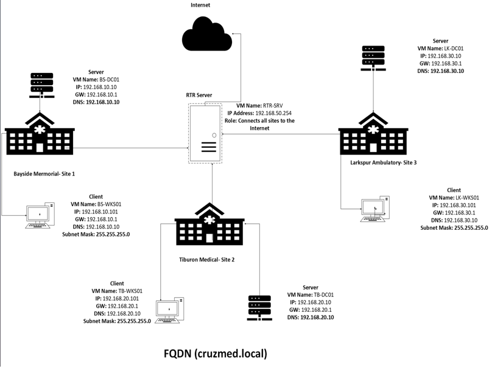
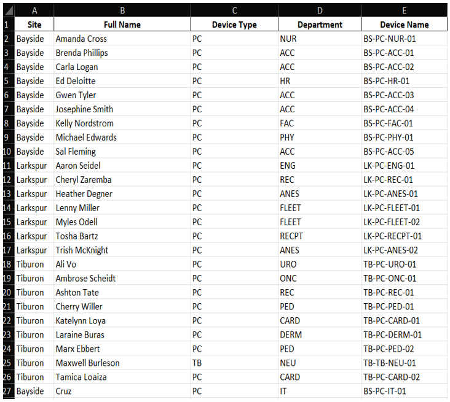

# Healthcare Active Directory Infrastructure Project

## Overview
This project focuses on designing and planning a multi-site Active Directory infrastructure for a healthcare organization consisting of Bayside Memorial Hospital, Tiburon Medical Park, and Larkspur Ambulatory Complex. The project was built to simulate a real-world enterprise Windows Server environment with centralized management, secure authentication, replication planning, and disaster recovery considerations.

---

## Scenario
A healthcare organization is consolidating three medical facilities into a single managed Active Directory environment. The infrastructure must support secure communication, centralized administration, HIPAA-related security considerations, and reliable access to Electronic Medical Records (EMR) systems across all locations.

---

## Project Objectives
- Design and implement an Active Directory infrastructure
- Configure DNS support for Active Directory
- Develop logical and physical network designs
- Create Organizational Units (OUs) and group structures
- Plan Active Directory replication between sites
- Develop Group Policy and password security strategies
- Configure NTFS permissions and folder access controls
- Design backup and disaster recovery strategies
- Support secure access to healthcare systems and records
  
  ---
  
## Network Design

The environment was designed to support three healthcare facilities connected through a centralized Active Directory infrastructure.

- Bayside Memorial Hospital served as the primary site and central office
- Tiburon Medical Park and Larkspur Ambulatory Complex operated as remote locations
- Each site contained its own subnet for network segmentation and management
- Domain services were centrally managed through Windows Server and Active Directory
- DNS and DHCP services supported client communication and device management
- Private T1 WAN links were used for secure inter-site communication between locations
- The design focused on centralized authentication, scalability, and secure access to EMR systems

  ---
  
## Device Naming Standards
The device naming standard was designed to make each system easy to identify based on site, device type, department, and number.

Naming format:

SITE-DEVICE-DEPARTMENT-##

Examples:
- BS-PC-NUR-01 = Bayside nurse workstation 01
- BS-PC-ACC-01 = Bayside accounting workstation 01
- TB-PC-CARD-01 = Tiburon cardiology workstation 01
- LK-PC-FLEET-01 = Larkspur fleet workstation 01

This naming structure helps with inventory tracking, troubleshooting, documentation, and future expansion.

---

## IP Addressing Plan
The network was divided into separate subnets for each healthcare facility to improve organization, security, and network management.

Subnet Allocation:
- Bayside Memorial Hospital: 10.0.1.0/24
- Tiburon Medical Park: 10.0.2.0/24
- Larkspur Ambulatory Complex: 10.0.3.0/24

Server and infrastructure devices used static IP addressing, while client workstations received IP addresses dynamically through DHCP.

DNS services supported Active Directory name resolution and communication between systems across all locations.

The addressing structure was designed to support scalability, simplified troubleshooting, and secure communication between sites.

---

## Active Directory OU Structure
The Active Directory environment was organized using Organizational Units (OUs) to simplify administration, policy management, and access control across all healthcare locations.

The OU structure separated users, computers, groups, and departments by location and function.

Example OU Structure:
- Bayside Memorial Hospital
  - Users
  - Computers
  - Groups
  - IT
  - Administration
  - Nursing

- Tiburon Medical Park
  - Users
  - Computers
  - Groups
  - Medical Staff

- Larkspur Ambulatory Complex
  - Users
  - Computers
  - Groups
  - Transportation

This structure allowed Group Policy Objects (GPOs) and permissions to be applied efficiently based on department roles and organizational requirements.

---

## Replication Strategy
Active Directory replication was designed to maintain consistent directory information across all healthcare locations.

The Bayside Memorial Hospital site functioned as the primary central office and main replication hub. Remote locations replicated Active Directory data through secure WAN/T1 connections.

Replication planning focused on:
- Maintaining consistent user and computer account information
- Synchronizing Group Policy Objects (GPOs)
- Supporting reliable authentication between sites
- Reducing administrative overhead
- Improving fault tolerance and availability

Site replication ensured that updates made within the Active Directory environment were distributed across all facilities while maintaining centralized management and secure communication.

---

## Password and GPO Strategy
Group Policy Objects (GPOs) were implemented to strengthen security, standardize system configurations, and support HIPAA-related requirements within the healthcare environment.

Password policies included:
- Minimum password length requirements
- Password complexity enforcement
- Password expiration policies
- Account lockout thresholds after failed login attempts

Additional Group Policy configurations included:
- Desktop and Control Panel restrictions
- Automatic screen lock timeouts
- Security auditing settings
- Windows Defender configuration
- Restricted administrative access
- Mapped network drives and shared folder access

The GPO strategy helped improve centralized management, endpoint security, and compliance across all healthcare locations.

---

## Folder Access and NTFS Permissions
NTFS permissions and shared folder access were configured using role-based access control principles to help secure sensitive healthcare data.

Access permissions were assigned based on department responsibilities and organizational roles.

Examples included:
- Nursing staff granted access to patient care documentation folders
- Billing departments restricted to financial and insurance-related data
- IT administrators provided elevated access for system management and support
- General users restricted from accessing unauthorized departments or confidential records

Security groups were used to simplify permission management and improve scalability across the environment.

This approach helped support:
- Least privilege access
- Centralized permission management
- Data confidentiality
- HIPAA-related security practices
- Reduced risk of unauthorized access
  
  ---
  
## Backup and Disaster Recovery Plan
A backup and disaster recovery strategy was developed to help protect critical healthcare systems, user data, and Active Directory services from outages, accidental deletion, ransomware, or hardware failure.

The backup strategy included:
- Daily incremental backups for user files and system changes
- Weekly full backups of servers and infrastructure systems
- Monthly archive backups for long-term retention and recovery
- Backup copies stored both locally and off-site for redundancy

Critical systems included:
- Active Directory databases
- DNS and DHCP configurations
- User-created documents
- Electronic Medical Record (EMR) systems
- Server configuration data

The disaster recovery plan focused on minimizing downtime, maintaining business continuity, and supporting secure recovery operations across all healthcare locations.

---

## Skills Demonstrated
- Active Directory Administration
- Windows Server Management
- DNS and DHCP Configuration
- Group Policy Management (GPO)
- Organizational Unit (OU) Design
- Network Infrastructure Planning
- IP Addressing and Subnetting
- NTFS Permissions Management
- Backup and Disaster Recovery Planning
- Technical Troubleshooting
- System Administration
- Virtualization
- Security Policy Implementation
- Documentation and Technical Planning
  
  ---
  
## Lessons Learned
This project strengthened my understanding of enterprise Windows environments, centralized administration, and infrastructure planning within a healthcare organization.

Through this project, I gained hands-on experience with:
- Active Directory design and management
- Group Policy implementation
- Network segmentation and IP planning
- Organizational Unit structure
- Replication planning between multiple sites
- Backup and disaster recovery concepts
- Role-based access control and NTFS permissions

This project also improved my troubleshooting, documentation, and technical planning skills while reinforcing the importance of security, scalability, and centralized management in enterprise environments.

---

## Technologies Used

- Windows Server
- Active Directory Domain Services (AD DS)
- DNS
- DHCP
- Group Policy Management
- PowerShell
- VirtualBox
- Windows 10/11
- Networking Fundamentals
  
